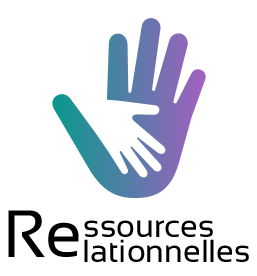

Ressources relationnelles
========================

Qu'est-ce que le projet Ressources relationnelles ?
--------------

Le but de ce projet est de créer une plateforme qui pourrait être porté par le Ministère des Solidarités et de la Santé à destination des citoyens afin de proposer une plateforme de sources, ressources, et d’échanges.

Cette application permet de :

- S'inscrire et se connecter à l'application.
- Poster des vidéos, textes, fichier audio sur la plateforme.
- Consulter des "Ressources"
- S'abonner à des utilisateurs
- Ajouter des réactions aux "Ressources"
- Administrer les utilisateurs

Technologies utilisé
--------------

- [Symfony 3.4][1]
- [React][2]
- [React Native][3]

Installation
------------

**Les instructions pour l'installation de la plateforme se situe sur le fichier [setup.md][4]**

------------

Enjoy ;)

[1]:  https://symfony.com/doc/3.4/setup.html
[2]:  https://fr.reactjs.org/
[3]:  https://reactnative.dev/
[4]:  API/setup.md
